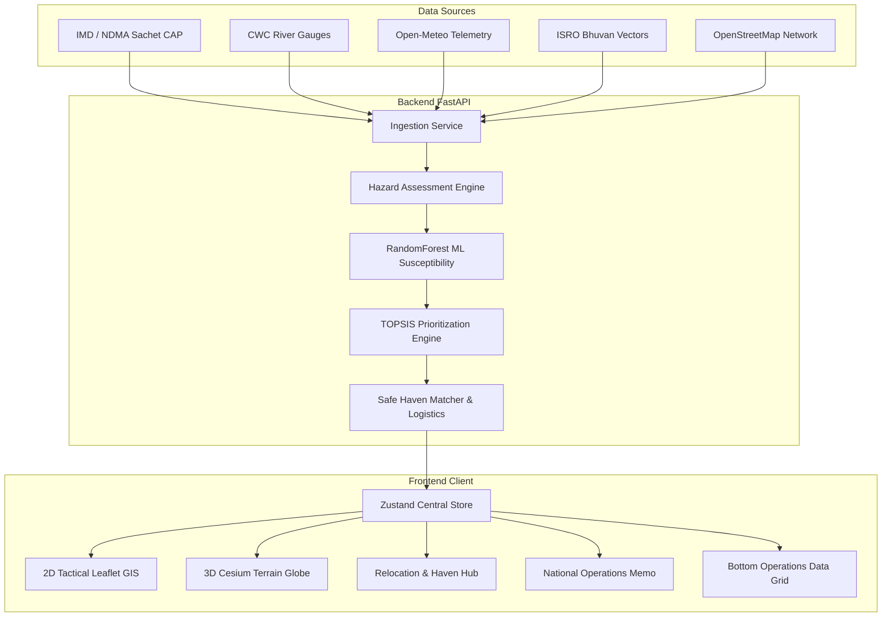

# ResQ-GIS

<p align="center">
  
  
  
  
</p>

**ResQ-GIS** is an AI and GIS-driven spatial decision-support platform designed for **proactive disaster relocation and evacuation intelligence**. While conventional emergency platforms stop at passive alerts and hazard visualization, ResQ-GIS closes the loop by solving the most critical logistical challenge in civil protection: **matching endangered human settlements with verified, structurally resilient safe havens and computing end-to-end evacuation logistics before catastrophic impact**.

---

## 🎯 The Core Mission: Relocation Intelligence

```
Hazard Trigger (IMD / CWC / GLOF)
       ↓
Settlement Exposure & Vulnerability (HVI + ML Random Forest)
       ↓
Institutional Safe Haven Verification (NCRMP MPCS / Stadiums / Plateaus)
       ↓
Logistical Capacity Balance (Evacuee Influx Demand vs. Bed Capacities)
       ↓
Convoy & Fleet Routing (Buses + Ambulances + Rations + Lifeline NH Corridors)
       ↓
Actionable National Relocation Operations Memo (NDMA Format)
```

---

## 🌐 Multi-Hazard Coverage Across 10 States

ResQ-GIS provides deep geospatial risk profiling and evacuation intelligence across 10 vulnerable Indian states, covering diverse geological, hydrological, and meteorological hazards:

| # | State | Focal Districts & Hotspots | Primary Disaster Typologies | Lifeline Corridors |
|---|---|---|---|---|
| 1 | **Uttarakhand** | Chamoli, Rudraprayag, Pithoragarh, Uttarkashi | Active land subsidence, GLOF, Alaknanda/Mandakini flash floods (*Joshimath, Marwari, Reni*) | NH-7, NH-107 |
| 2 | **Himachal Pradesh** | Kullu, Mandi, Kinnaur | Extreme cloudburst debris flows, Beas river torrential surges (*Manali, Old Mandi*) | NH-3, NH-154 |
| 3 | **Kerala** | Wayanad, Idukki, Alappuzha | Deep-seated slope failures, debris avalanches, Kuttanad delta submersion (*Chooralmala, Mundakkai, Munnar*) | NH-66, NH-766 |
| 4 | **Andhra Pradesh** | Dr. B.R. Ambedkar Konaseema, Visakhapatnam | Severe cyclonic landfalls, marine storm surges, Godavari delta inundation (*Razole, Sagar Nagar*) | NH-16, NH-216 |
| 5 | **Assam** | Majuli, Cachar (Barak Valley), Dima Hasao | Brahmaputra river island erosion, Barak mega-basin flooding (*Salmora, Silchar*) | NH-27, NH-37 |
| 6 | **Sikkim** | Mangan, Gangtok (Teesta Basin) | High-altitude GLOF (South Lhonak outburst), dam overtopping, highway collapse (*Chungthang, Singtam*) | NH-10 |
| 7 | **Odisha** | Jagatsinghpur, Puri, Ganjam | Super-cyclones, coastal storm surges, delta saline ingress (*Erasama, Brahmagiri*) | NH-16, NH-316 |
| 8 | **Jammu & Kashmir** | Anantnag, Srinagar | Jhelum river basin overspill, rapid glacial-fed valley inundation (*Bijbehara, Batwara*) | NH-44 |
| 9 | **Meghalaya** | East Khasi Hills (Sohra Plateau) | World-record orographic downpours, vertical sandstone escarpment collapse (*Cherrapunji, Shella*) | NH-206 |
| 10 | **Manipur & Nagaland** | Noney, Kohima | Deep railway cutting debris slips, monsoon hill-slope sinking (*Tupul, Dzüvürü*) | NH-37, NH-29 |

---

## 🏛️ Engineered Safe Haven Relocation Registry

ResQ-GIS categorizes and monitors **21 verified institutional safe refuges** engineered specifically for high-capacity disaster survival:

- **Multi-Purpose Cyclone Shelters (MPCS)**: Built under the *National Cyclone Risk Mitigation Project (NCRMP)* with stilt-mounted Category-IV RCC, rated for 250+ km/h super-cyclonic winds and coastal storm surge clearance.
- **Elevated Public Infrastructure**: District indoor stadiums, elevated government polytechnics, and ridge-line administrative complexes.
- **Engineered Elevation Clearances**: Verified clearance from `+15m` up to `+180m` above the 100-year flood plane.
- **Institutional Oversight**: Maintained under NDMA, State Disaster Management Authorities (KSDMA, ASDMA, APSDMA, OSDMA), and District Emergency Operation Centres (DEOC).
- **Critical Life-Support Systems**:
  - Solar-DG dual-grid backup power
  - High-capacity RO water purification plants
  - Medical trauma and casualty stabilization bays
  - SATCOM emergency transceivers and amateur radio (HAM) relays
  - Rooftop helipads and airdrop landing pads

---

## ⚡ Key Platform Capabilities

### 1. Dual-Engine Spatial GIS
- **2D Tactical Leaflet GIS**: Responsive vector styling, interactive settlement clusters, live radar and rain gauge overlays, hazard buffer rings, and evacuation route vectors.
- **3D Cesium Terrain Globe**: True-to-life 3D digital elevation models (DEM), tilt/pitch camera controls, dynamic altitude flying, and real mountain valley inspection.

### 2. National Relocation Operations Memo (Reports)
- **Sector Relocation Balance Sheet**: Instant comparison between *Evacuee Influx Demand* (from HIGH/CRITICAL settlements) and *Safe Haven Capacity*, with real-time carrying capacity badges (Surplus / Deficit).
- **Evacuation Transport & Fleet Calculator**: Calculates exact requirements for:
  - 50-seater evacuation convoy buses
  - Advanced Life-Support (ALS) ambulances
  - 14-day emergency rations tonnage (standard NDMA nutrition norms)
- **Settlement Relocation Allocation Matrix**: 1-to-1 pairing of vulnerable villages with their primary and secondary safe havens, transit mileage, and highway corridor.
- **Export & Action**: One-click printable PDF memo and standardized CSV data export.

### 3. Multi-Criteria Prioritization (TOPSIS Engine)
- Mathematical ranking of settlements based on:
  - Hazard exposure (slope, flood depth, precipitation)
  - Habitation Vulnerability Index (HVI: age demographics, kutcha/pucca housing ratio, healthcare proximity)
  - Distance and route passability to nearest safe haven
- Integrates a **RandomForest ML Susceptibility Classifier** outputting real-time confidence intervals.

### 4. Surveillance Zones & Operational Workspaces
- Define custom circular or polygonal Areas of Interest (AOI).
- Save regional taskforces (e.g., *Chamoli Taskforce*, *Wayanad Watch*, *Brahmaputra Basin Unit*).
- Instant telemetry scanning of population exposure within active surveillance zones.

### 5. Multi-Agency Ingestion Feeds
- **IMD / Sachet CAP Feeds**: Cyclone warnings, flash flood guidance, and thunderstorm alerts.
- **Open-Meteo Weather**: 24-hour live precipitation, temperature, and wind barometrics.
- **Central Water Commission (CWC)**: Hydrological river station telemetry (Warning vs. Danger flood stages).
- **ISRO Bhuvan & Census**: LULC classification, elevation contours, and administrative boundary layers.
- **OpenStreetMap (OSM)**: Road network passability, lane classifications, and bridge choke points.

---

## 🏗️ Architecture



---

## 🚀 Quick Start Guide

### Prerequisites
- **Node.js** >= 18.x
- **Python** >= 3.10
- **npm** or **pnpm**

---

### 1. Frontend Setup

```bash
# Navigate to frontend
cd frontend

# Install dependencies
npm install

# Start Vite development server
npm run dev

# The operator dashboard is available at http://localhost:3000
```

To build for production:
```bash
npm run build
```

---

### 2. Backend Setup

```bash
# Navigate to backend
cd backend

# Create virtual environment (optional but recommended)
python -m venv .venv
# Windows:
.venv\Scripts\activate
# Linux/macOS:
source .venv/bin/activate

# Install Python requirements
pip install -r requirements.txt

# Configure environment
cp .env.example .env

# Run FastAPI backend
uvicorn app.main:app --reload --port 8000

# Interactive Swagger API documentation: http://localhost:8000/api/docs
```

---

## 📡 API Endpoints Overview

| Method | Endpoint | Description |
|---|---|---|
| `GET` | `/api/v1/system/status` | Telemetry health, connected services, and provider statuses |
| `GET` | `/api/v1/habitations` | List settlements with demographics, risk scores, and coordinates |
| `GET` | `/api/v1/habitations/{id}` | Detailed habitation vulnerability profile and nearest safe haven |
| `GET` | `/api/v1/relocation-sites` | List all verified institutional safe havens and live bed capacity |
| `GET` | `/api/v1/hazard-assessment/{id}` | Dynamic slope, river proximity, rainfall, and ML hazard prediction |
| `POST` | `/api/v1/prioritization/run` | Execute TOPSIS multi-criteria evacuation priority ranking |
| `GET` | `/api/v1/alerts` | Active CAP disaster alerts from IMD and NDMA Sachet |
| `GET` | `/api/v1/rivers` | Central Water Commission gauging stations and water levels |

---

## 🛡️ License

This project is licensed under the **OpenBUSL License (Business Source License — Non-Commercial & Community Edition)**.

- **Permitted**: Free for non-commercial research, academic study, humanitarian relief, civil defense organizations, and open community contributions.
- **Commercial Restrictions**: Commercial deployment, private hosted SaaS, and proprietary licensing require written authorization.
- See the full terms in [`LICENSE`](./LICENSE).

---

<p align="center">
  <b>ResQ-GIS</b> — Built for disaster resilience, proactive relocation, and saving lives before impact.
</p>
